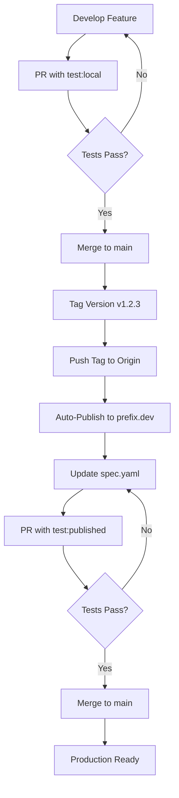

# Development Workflow Guide

This document describes the development and release process for custom ecoscope workflows and task libraries.

## Table of Contents
- [Development Workflow](#development-workflow)
- [CI/CD Overview](#cicd-overview)
- [Release Process](#release-process)
- [Best Practices](#best-practices)
- [Troubleshooting](#troubleshooting)

---

## Development Workflow

### Phase 1: Development with Local Builds

When implementing new task libraries or workflows:

1. **Create a feature branch**
   ```bash
   git checkout -b feature/my-new-workflow
   ```

2. **Implement your changes**
   - Add/modify task libraries in `src/`
   - Create/update workflows in `workflows/`
   - Update workflow `spec.yaml` with local development dependencies
   - Add test cases in `test-cases.yaml`

3. **Test locally during development**
   ```bash
   # Run tests for a specific workflow and test case
   ./dev/pytest-cli.sh <workflow_name> <test_case>
   ```

4. **Create a Pull Request with `test:local` label**
   - Open a PR against `main`
   - Add the **`test:local`** label

   **What happens:**
   - ✅ Runs unit tests (Python tests in `src/`)
   - ✅ Builds packages locally from source
   - ✅ Recompiles workflows with local build artifacts
   - ✅ Runs workflow tests using local packages
   - ✅ Tests on Ubuntu, macOS, and Windows

5. **Review and merge**
   - Address any test failures or review comments
   - Once approved, merge to `main`

---

### Phase 2: Publishing Task Libraries

After merging your changes to `main`, publish the task libraries to prefix.dev:

1. **Tag a release version**
   ```bash
   # For production release
   git tag v1.2.3

   # For release candidate
   git tag v1.2.3rc1

   # Push the tag to trigger publishing
   git push origin v1.2.3
   ```

2. **Automatic Publishing**
   The `publish.yml` workflow automatically:
   - ✅ Builds release packages from the tagged commit
   - ✅ Publishes packages to prefix.dev (for version tags only)
   - ✅ Makes packages available at `https://repo.prefix.dev/ecoscope-workflows-custom/`

**Tag Format:**
- Production: `v1.2.3` (follows semantic versioning)
- Release Candidate: `v1.2.3rc1`

**Note:** Only version tags (starting with `v`) trigger publishing to prefix.dev.

---

### Phase 3: Testing with Published Packages

After publishing to prefix.dev, update workflows to use the published packages:

1. **Create a new branch**
   ```bash
   git checkout -b update/published-packages
   ```

2. **Update `spec.yaml` for each workflow**
   ```yaml
   requirements:
     - name: ecoscope-workflows-ext-ste
       version: "1.2.3.*"  # ← Update to published version
       channel: https://repo.prefix.dev/ecoscope-workflows-custom/
   ```

   **Important validation rules:**
   - ❌ NO wildcard versions (`version: "*"`)
   - ❌ NO local file channels (`channel: file://...`)
   - ✅ Use specific version patterns
   - ✅ Use remote HTTPS channels

3. **Create PR with `test:published` label**
   - Open a PR with your spec.yaml changes
   - Add the **`test:published`** label

   **What happens:**
   - ✅ Validates `spec.yaml` (no wildcards, no file:// channels)
   - ✅ Validates `test-cases.yaml` exists with at least one test case
   - ✅ Recompiles workflows with published packages
   - ✅ Runs workflow tests using published packages
   - ✅ Tests on Ubuntu, macOS, and Windows

4. **Merge after validation**
   - Once all tests pass, merge to `main`
   - Workflows now use stable published packages

---

## CI/CD Overview

### Workflows Summary

| Workflow | Trigger | Purpose |
|----------|---------|---------|
| **test-tasks.yml** | Push to `main`, PR with `test:unit` or `test:local` | Run Python unit tests |
| **test-with-local-build.yml** | PR with `test:local` | Test workflows with locally built packages |
| **test-with-published-packages.yml** | PR with `test:published` | Test workflows with published packages, validate spec.yaml |
| **validate-labels.yml** | PR events | Ensure PR has required test label |
| **publish.yml** | Push to `main` or version tag | Build and publish packages to prefix.dev |

### Main Branch Behavior

When code is pushed to `main`:
- ✅ Unit tests run automatically
- ❌ Workflow integration tests do NOT run (use PR labels for testing)

---

## Release Process

### Complete Release Cycle



### Step-by-Step

1. **Development** → PR with `test:local` label
2. **Merge** to `main`
3. **Tag** version: `git tag v1.2.3 && git push origin v1.2.3`
4. **Wait** for publish workflow to complete
5. **Update** `spec.yaml` with published version
6. **Test** → PR with `test:published` label
7. **Merge** to `main`

---

## Best Practices

### During Development

- ✅ Always use `test:local` for task library changes
- ✅ Run tests locally before pushing: `./dev/pytest-cli.sh workflow_name test_case`
- ✅ Keep test cases up to date in `test-cases.yaml`
- ✅ Update PR template checklist

### Before Publishing

- ✅ Ensure all `test:local` tests pass
- ✅ Review changelog and version number
- ✅ Use semantic versioning (major.minor.patch)
- ✅ Test release candidates with `rc` suffix first

### After Publishing

- ✅ Verify packages appear on prefix.dev
- ✅ Update spec.yaml with specific version patterns
- ✅ Use `test:published` to validate before merging
- ✅ Never use wildcard versions in production

### Version Patterns

```yaml
# ✅ Good - Specific version pattern
version: "1.2.3.*"  # Allows patch updates

# ✅ Good - Exact version
version: "1.2.3"

# ❌ Bad - Wildcard (fails test:published validation)
version: "*"

# ❌ Bad - Too broad
version: "1.*"
```

---

## Troubleshooting

### PR Label Validation Failed

**Error:** "PR must have one of the following labels..."

**Solution:** Add at least one label: `test:unit`, `test:local`, or `test:published`

---

### spec.yaml Validation Failed

**Error:** "Found wildcard version (*) in requirements"

**Solution:** Replace `version: "*"` with specific version like `version: "1.2.3.*"`

**Error:** "Found local file channel (file://) in requirements"

**Solution:** Use remote HTTPS channel: `channel: https://repo.prefix.dev/...`

---

### test-cases.yaml Validation Failed

**Error:** "No test cases found in test-cases.yaml"

**Solution:** Add at least one test case:
```yaml
my-test-case:
  params:
    # ... test parameters
```

---

### Cross-Platform Test Failures

If tests pass on Linux but fail on Windows/macOS:
- Check for hardcoded paths (use `${{ github.workspace }}`)
- Verify bash script compatibility
- Check for platform-specific dependencies

---

### Package Publish Failure

If the package failed to publish to prefix:
- Check if the tag exists on main branch
- Check if `PREFIX_API_KEY` is correctly set up in the repo

