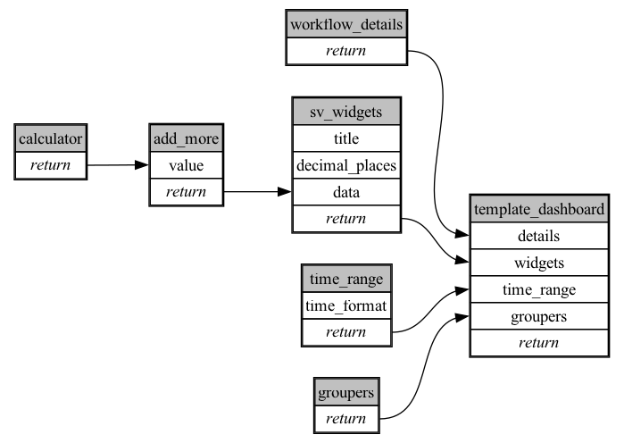

```
# AUTOGENERATED BY ECOSCOPE-WORKFLOWS; see fingerprint in README.md for details

```

```yaml
# fingerprint:
artifacts_sha256_basic: cb2a234c2ef770acc876b013be92d81ef873ca514970075ed52e2434da01ad14
artifacts_sha256_strict: 734085be729429c5c1a1b4deefe0ec1ce60d4f29fa666a56fca921f9c5f6c646
installed_requirements:
- channel: https://repo.prefix.dev/ecoscope-workflows/
  name: ecoscope-workflows-core
  version: {version: ==0.19.3}
- channel: file:///tmp/ecoscope-workflows-custom/release/artifacts/
  name: ecoscope-workflows-ext-ste
  version: {version: ==10000.dev3+g5fd3a37da.d20251218}
params_sha256: f9955d48836678dc7c9655e57ea90e9cd3a2fde7cfe079c928acd4e85129626a
spec_sha256: a1459e92c9ed4948e15287cd524edb973bff799f8a0db9ec094bc4c29509f1ae

```

# ecoscope-workflows-aerial-lines-workflow


