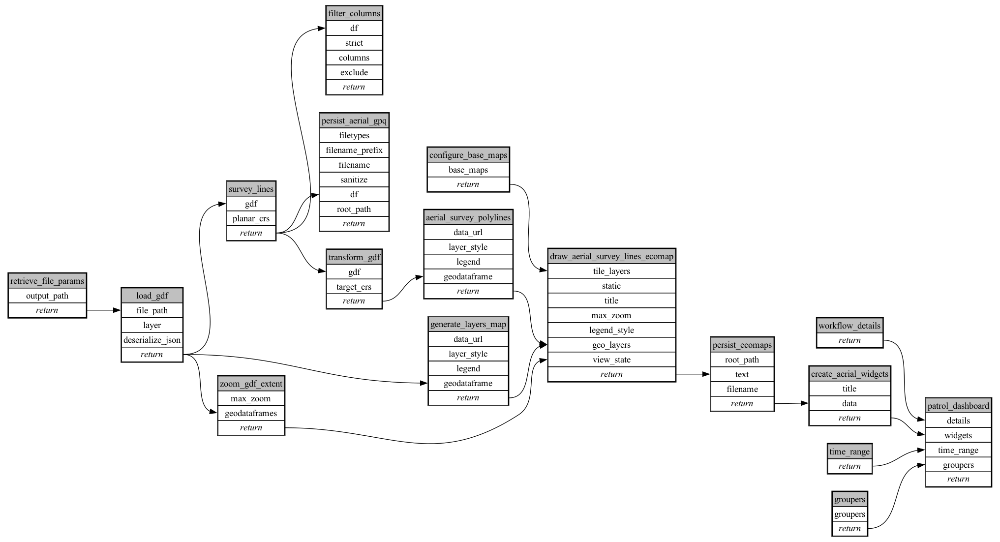

```
# AUTOGENERATED BY ECOSCOPE-WORKFLOWS; see fingerprint in README.md for details

```

```yaml
# fingerprint:
artifacts_sha256_basic: 11de6214f0cb4110d43ad49d45217f156cb447ebfaf1aa26962b38b6040ff4b8
artifacts_sha256_strict: b3aaf68ba3840f6ff105533a37be8ee98158df024ee8e8b065aed6e9a50cfced
installed_requirements:
- channel: https://repo.prefix.dev/ecoscope-workflows/
  name: ecoscope-workflows-core
  version: {version: ==0.22.17}
- channel: https://repo.prefix.dev/ecoscope-workflows/
  name: ecoscope-workflows-ext-ecoscope
  version: {version: ==0.22.17}
- channel: https://repo.prefix.dev/ecoscope-workflows-custom/
  name: ecoscope-workflows-ext-custom
  version: {version: ==0.0.39}
- channel: https://repo.prefix.dev/ecoscope-workflows-custom/
  name: ecoscope-workflows-ext-ste
  version: {version: ==0.0.18}
params_sha256: 8f0fe3ab469451ccc87f0a53240c20a70426cbed47544fbbf2976b6fc149c263
spec_sha256: 3f67edbef57dbf8811b6529e3b6699e5ff9fa0b7ce75e4d92d49e1e4c14b998a

```

# ecoscope-workflows-aerial-survey-lines-workflow


