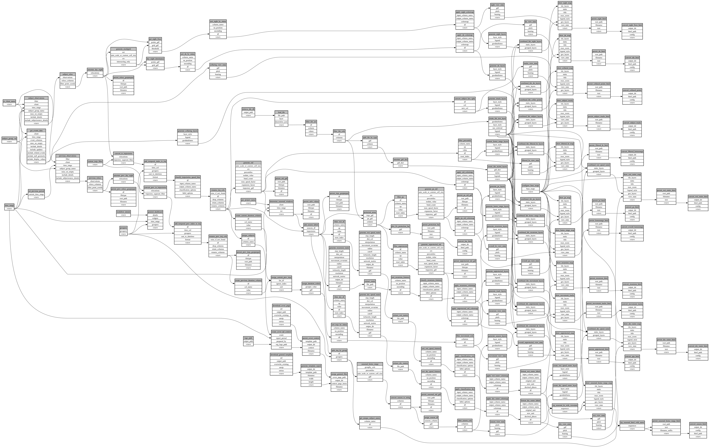

```
# AUTOGENERATED BY ECOSCOPE-WORKFLOWS; see fingerprint in README.md for details

```

```yaml
# fingerprint:
artifacts_sha256_basic: 375d33dccaea6c8ae91d140c4e7be05b673ec7beedc113e7f83d40b5943ec3cd
artifacts_sha256_strict: 414378711c3faa7754b957d5a300170f5173fda05565c53700ba8437a9159abb
installed_requirements:
- channel: https://repo.prefix.dev/ecoscope-workflows/
  name: ecoscope-workflows-core
  version: {version: ==0.22.9}
- channel: https://repo.prefix.dev/ecoscope-workflows/
  name: ecoscope-workflows-ext-ecoscope
  version: {version: ==0.22.9}
- channel: https://repo.prefix.dev/ecoscope-workflows-custom/
  name: ecoscope-workflows-ext-custom
  version: {version: ==0.0.28}
- channel: file:///tmp/ecoscope-workflows-custom/release/artifacts/
  name: ecoscope-workflows-ext-ste
  version: {version: ==0.0.17.dev5+g9fb58ab66}
params_sha256: 07250e0dac5da6caaf15737bcbe4fc87d9b28a7f346c1c24d971676b4a6e92c2
spec_sha256: 71c7288ea4cbf018800b19cdc53ed99f95a87babdabac7d19b826692f91d9f5b

```

# ecoscope-workflows-general-report-workflow


