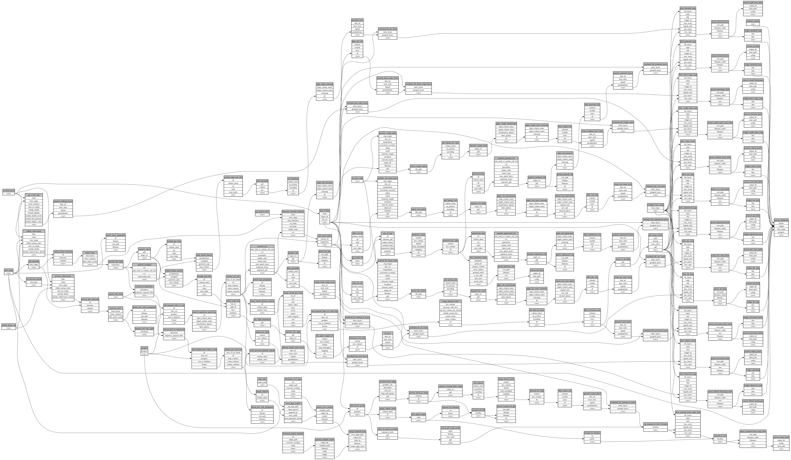

```
# AUTOGENERATED BY ECOSCOPE-WORKFLOWS; see fingerprint in README.md for details

```

```yaml
# fingerprint:
artifacts_sha256_basic: 56ce4cc9f5a7ba5e4557e140adb5fa382afd5df1124bd1ce76b891200ee53b85
artifacts_sha256_strict: dd76ed15bf56373325642efecc9b3b3826c92021d019579f2934ea169263ccac
installed_requirements:
- channel: https://repo.prefix.dev/ecoscope-workflows/
  name: ecoscope-workflows-core
  version: {version: ==0.22.18}
- channel: https://repo.prefix.dev/ecoscope-workflows/
  name: ecoscope-workflows-ext-ecoscope
  version: {version: ==0.22.18}
- channel: https://repo.prefix.dev/ecoscope-workflows-custom/
  name: ecoscope-workflows-ext-custom
  version: {version: ==0.0.43}
- channel: https://repo.prefix.dev/ecoscope-workflows-custom/
  name: ecoscope-workflows-ext-big-life
  version: {version: ==0.0.8}
- channel: https://repo.prefix.dev/ecoscope-workflows-custom/
  name: ecoscope-workflows-ext-ste
  version: {version: ==0.0.21.dev1+g884844be1.d20260511}
params_sha256: 076a699dd9f99b57e05137fec154b4336110c22fc0130730014a2b35c22e8bd5
spec_sha256: 216533faffb4e8514374a83a7f6cdcf898f96b63d94f5de4ee2a7ad0a53ef97b

```

# ecoscope-workflows-general-report-workflow


