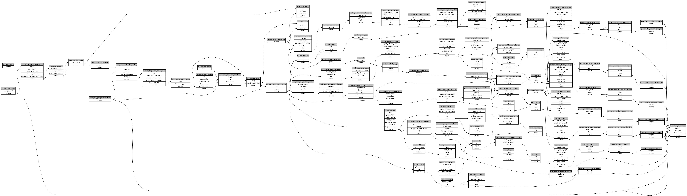

```
# AUTOGENERATED BY ECOSCOPE-WORKFLOWS; see fingerprint in README.md for details

```

```yaml
# fingerprint:
artifacts_sha256_basic: 062063b06d846cd497bb1eba85b80ccc97b627e486f2d3cc7a386a06cd004de5
artifacts_sha256_strict: f57aa5321412b0840437601f3691d329db64de07cd9c585011d282da0d4d4494
installed_requirements:
- channel: https://repo.prefix.dev/ecoscope-workflows/
  name: ecoscope-workflows-core
  version: {version: ==0.14.0}
- channel: https://repo.prefix.dev/ecoscope-workflows/
  name: ecoscope-workflows-ext-ecoscope
  version: {version: ==0.14.0}
- channel: file:///tmp/ecoscope-workflows-custom/release/artifacts/
  name: ecoscope-workflows-ext-ste
  version: {version: ==10000.dev64+g606a3a966.d20251110}
- channel: https://repo.prefix.dev/ecoscope-workflows-custom/
  name: ecoscope-workflows-ext-custom
  version: {version: ==0.0.6}
params_sha256: 5e3d29392d5d9ad9c2a83be64d860a2fbc3e446083b89085982ad62b17c61aa0
spec_sha256: b8c216a05d1c76a55c45aa84436e1568e673bed2e921f61491e8a4d9061c5e29

```

# ecoscope-workflows-mapbook-report-workflow


