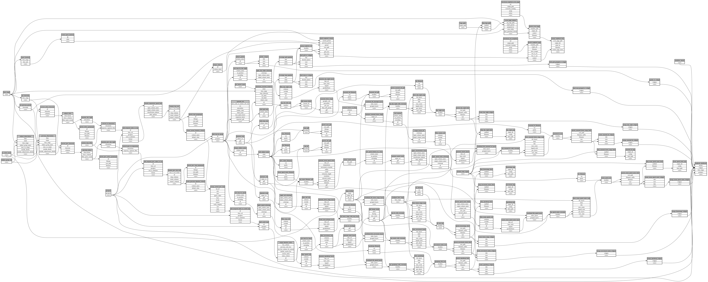

```
# AUTOGENERATED BY ECOSCOPE-WORKFLOWS; see fingerprint in README.md for details

```

```yaml
# fingerprint:
artifacts_sha256_basic: e238ef888663c9f551c08feef8ebf0e672c0a07cdf04b356c896950a9d544489
artifacts_sha256_strict: 2dba9f3643754c5491343f63e26c60addd6633cbe0663d53cf188d09313f1d95
installed_requirements:
- channel: https://repo.prefix.dev/ecoscope-workflows/
  name: ecoscope-platform
  version: {version: ==2.15.1}
- channel: https://repo.prefix.dev/ecoscope-workflows-custom/
  name: ecoscope-workflows-ext-custom
  version: {version: ==0.1.0rc14}
- channel: file:///tmp/ecoscope-workflows-custom/release/artifacts/
  name: ecoscope-workflows-ext-ste
  version: {version: ==0.0.23.dev3+g5b7d57c17.d20260706}
- channel: conda-forge
  name: pydeck
  version: {version: ==0.9.2}
- channel: conda-forge
  name: opentelemetry-sdk
  version: {version: ==1.43.0}
params_sha256: 3bba9a120fe620203b8f4bcc3e34ec76d13e027bc2a66a52ca6f0e1fed86e736
spec_sha256: 33ddcfda1bd8084cb7fb9fa611956b346aaa478a8387ff26977a97252e321238

```

# ecoscope-workflows-mapbook-report-workflow


